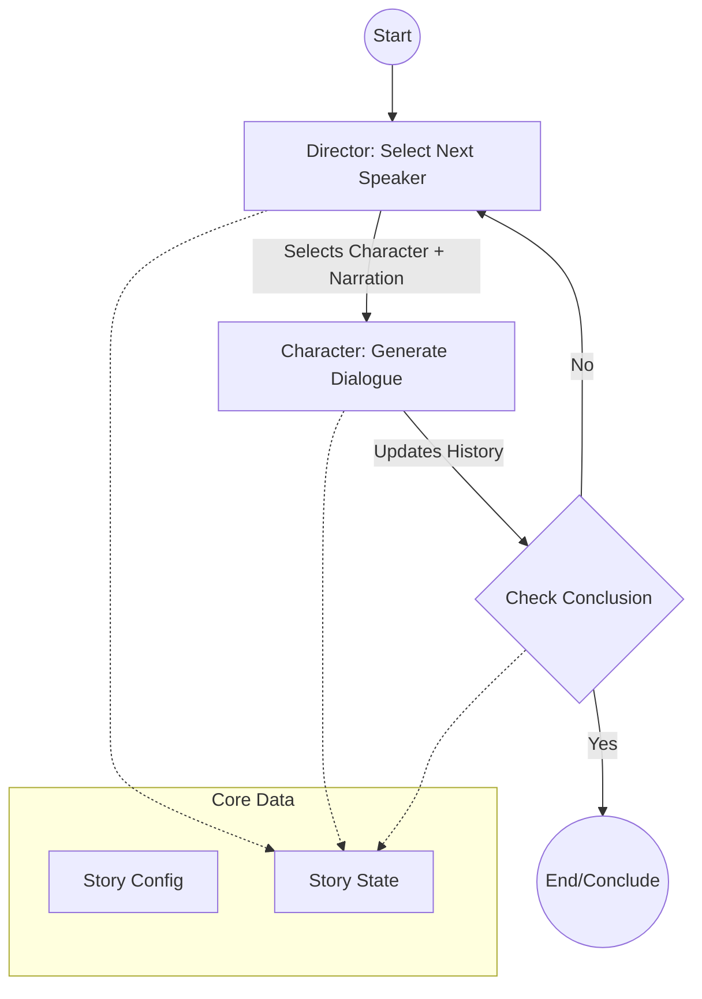

# GenAi_DSS: Multi-Agent Narrative System

## 1. Introduction
This repository serves as the base implementation for the **Generative AI module of the Hackfest x Datathon**.

The challenge is to design a **Multi-Agent Narrative System** where autonomous agents navigate a world defined by a "Story Seed." Unlike traditional chatbots, these agents must possess:
- A sense of physical presence.
- Memory of past interactions.
- The ability to execute non-verbal actions to resolve conflicts and achieve goals.

This starter codebase provides a foundational structure using **LangGraph** to demonstrate agentic flow, character interaction, and director oversight.

## 2. Setup

This project uses `uv` for dependency management.

### Prerequisites
- Python 3.11+
- `uv` package manager

### Installation

1.  **Fork the repository**:
    - Go to the repository page on GitHub.
    - Click the **Fork** button in the top-right corner to create your own copy.
    - Clone *your forked repository*:
      ```bash
      git clone https://github.com/YOUR_USERNAME/GenAi_DSS.git
      cd GenAi_DSS
      ```

2.  **Install dependencies**:
    ```bash
    uv sync
    ```

3.  **Environment Configuration**:
    Create a `.env` file in the root directory and add your Google API Key:
    ```ini
    GOOGLE_API_KEY=your_api_key_here
    ```

## 3. System Guide

The system is built on a modular architecture to simulate a narrative environment.

### Core Components

- **The Director (`DirectorAgent`)**:
    - Acts as the central controller.
    - Decides which character speaks next based on the narrative context.
    - Monitors the story for conclusion conditions.
    - Inject narrations to guide the plot.

- **Character Agents (`CharacterAgent`)**:
    - Distinct personas defined in `character_configs.json`.
    - Generate dialogue based on their personality, the current story state, and the "Story Seed".
    - Currently implemented as purely conversational agents.

- **Narrative Graph (`NarrativeGraph`)**:
    - The state machine that orchestrates the flow of the simulation.
    - Built using `LangGraph`.
    - Manages the loop: `Director Selects` -> `Character Speaks` -> `Check Conclusion`.

- **Story State (`StoryStateManager`)**:
    - Maintains the current state of the world, including dialogue history and character profiles.
    - Loaded from `seed_story.json` and `character_configs.json`.

## 4. System Architecture

The following diagram illustrates the current flow of the system:



## 5. Usage

To run the example scenario ("The Rickshaw Accident"):

```bash
uv run src/main.py
```

The system will:
1. Load the seed story and characters.
2. Initialize the agents.
3. Run the dialogue loop for a maximum number of turns (default 25).
4. Save the story transcript and logs.

### Output Files

Your system is required to generate the following output files (exact fields may vary, but core content should be similar):

**1. Narration Output (`story_output.json`)**
This file records the final narrative trace of the simulation. It should contain:
- **Metadata**: Title, seed story description.
- **Events**: A chronological list of turns, including:
    - `type`: "dialogue" or "narration".
    - `speaker`: Who spoke (for dialogue).
    - `content`: The actual text generated.
    - `turn`: The turn number.
- **Conclusion**: Why the story ended.

**2. Prompts Log (`prompts_log.json`)**
This file serves as a debug/audit log for the LLM interactions. It should track:
- `timestamp`: When the request was made.
- `agent`: Which agent (Director or Character) made the request.
- `prompt`: The full text prompt sent to the LLM.
- `response`: The raw response received from the model.

## 6. Disclaimer: Bare Minimum Setup

> [!IMPORTANT]
> **This is a starter kit.** It contains the essential structure but **LACKS** the advanced features required for the full competition challenge.

**Missing Features you must implement:**
- **Actions**: The current agents only talk. They cannot perform actions like `[ACTION: Picks up phone]`.
- **World State / Inventory**: There is no tracking of physical items or location changes.
- **Deep Memory**: The memory is currently just a simple dialogue history buffer.
- **Complex Reasoning**: Agents do not currently have a "Reasoning" step before they speak/act.

You are expected to extend this codebase to include these features as described in the problem statement.
